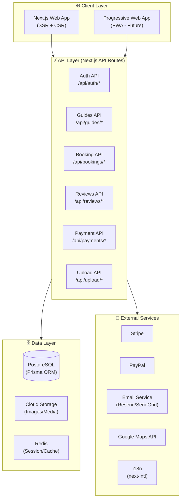
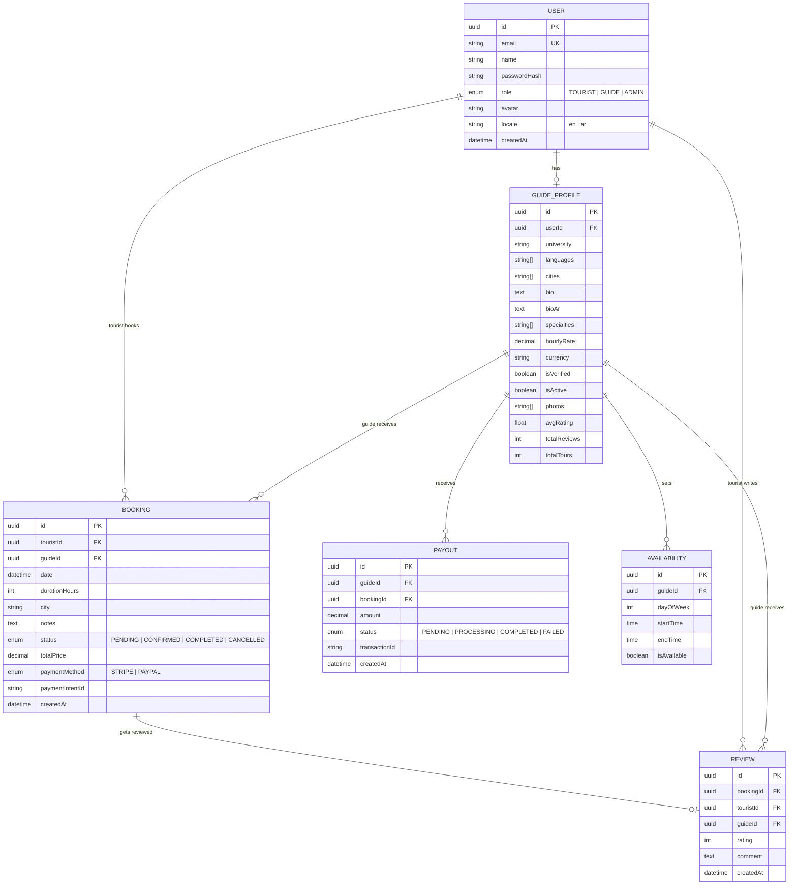
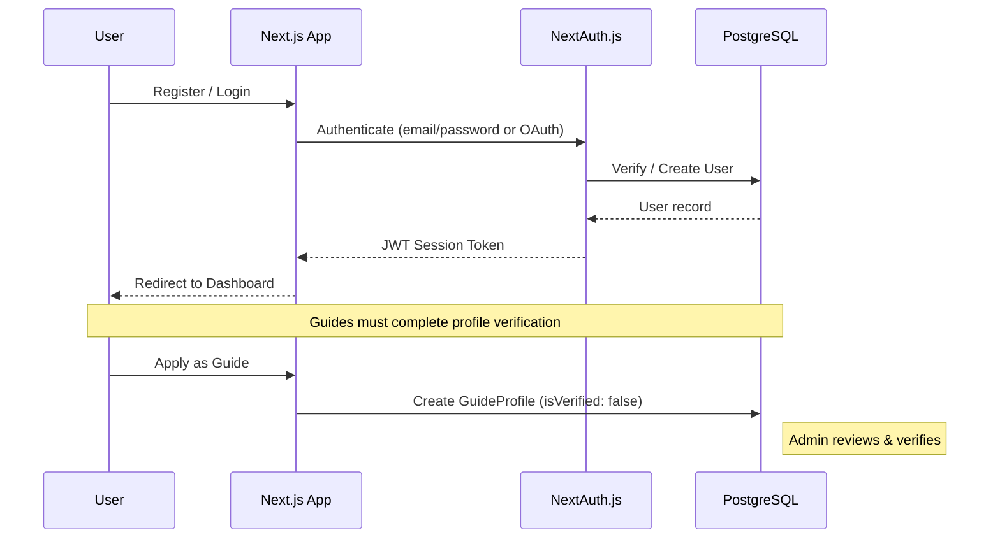
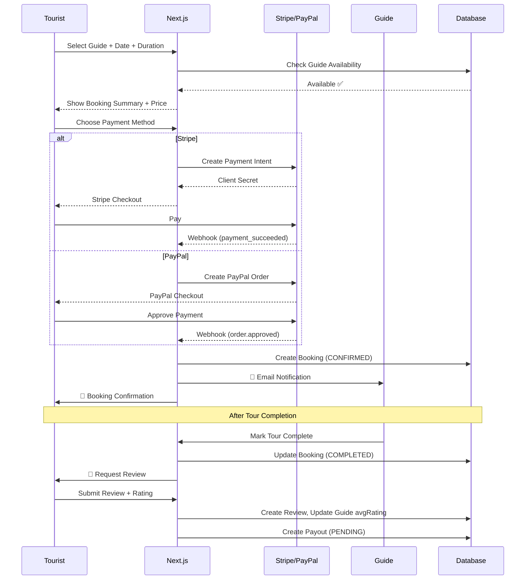

# 🇸🇾 SyriaGuide — Tourism Guide Booking Platform

## Architecture Plan: Grob- & Feinarchitektur

---

## 1. Vision & Concept

**SyriaGuide** is a marketplace platform connecting international tourists with local Syrian university students who serve as personal tour guides. Students earn income while sharing authentic local knowledge, and tourists get genuine, off-the-beaten-path experiences.

> **Core Value Proposition:** Authentic local experiences powered by educated young Syrians — affordable for tourists, empowering for students.

---

## 2. Grobarchitektur (High-Level Architecture)



### Core Modules Overview

| Module | Purpose | Priority |
|--------|---------|----------|
| **Auth & Users** | Registration, login, roles (Tourist/Guide/Admin) | 🔴 P0 |
| **Guide Profiles** | Profile creation, verification, portfolio | 🔴 P0 |
| **Search & Discovery** | Find guides by city, language, specialty | 🔴 P0 |
| **Booking System** | Request, confirm, manage bookings | 🔴 P0 |
| **Payments** | Stripe + PayPal integration, payouts | 🔴 P0 |
| **Reviews & Ratings** | Post-tour reviews, star ratings | 🟡 P1 |
| **Messaging** | In-app chat between tourist & guide | 🟡 P1 |
| **Admin Dashboard** | Manage users, guides, bookings, disputes | 🟡 P1 |
| **i18n** | Arabic (RTL) + English support | 🔴 P0 |

---

## 3. Feinarchitektur (Detailed Architecture)

### 3.1 Project Structure

```
syria-guide/
├── prisma/
│   ├── schema.prisma          # Database schema
│   ├── migrations/            # DB migrations
│   └── seed.ts                # Seed data
├── public/
│   ├── locales/
│   │   ├── en/                # English translations
│   │   └── ar/                # Arabic translations
│   └── images/                # Static assets
├── src/
│   ├── app/
│   │   ├── [locale]/          # i18n routing
│   │   │   ├── layout.tsx     # Root layout (RTL/LTR)
│   │   │   ├── page.tsx       # Landing page
│   │   │   ├── guides/
│   │   │   │   ├── page.tsx           # Browse guides
│   │   │   │   └── [id]/page.tsx      # Guide profile
│   │   │   ├── booking/
│   │   │   │   ├── [guideId]/page.tsx # Create booking
│   │   │   │   └── confirmation/page.tsx
│   │   │   ├── dashboard/
│   │   │   │   ├── tourist/page.tsx   # Tourist dashboard
│   │   │   │   └── guide/page.tsx     # Guide dashboard
│   │   │   ├── auth/
│   │   │   │   ├── login/page.tsx
│   │   │   │   ├── register/page.tsx
│   │   │   │   └── register/guide/page.tsx
│   │   │   └── admin/
│   │   │       ├── page.tsx           # Admin overview
│   │   │       ├── users/page.tsx
│   │   │       └── bookings/page.tsx
│   │   └── api/
│   │       ├── auth/[...nextauth]/route.ts
│   │       ├── guides/route.ts
│   │       ├── bookings/route.ts
│   │       ├── reviews/route.ts
│   │       ├── payments/
│   │       │   ├── stripe/route.ts
│   │       │   ├── paypal/route.ts
│   │       │   └── webhook/route.ts
│   │       └── upload/route.ts
│   ├── components/
│   │   ├── ui/                # Reusable UI primitives
│   │   │   ├── Button.tsx
│   │   │   ├── Card.tsx
│   │   │   ├── Input.tsx
│   │   │   ├── Modal.tsx
│   │   │   ├── Avatar.tsx
│   │   │   ├── Badge.tsx
│   │   │   ├── StarRating.tsx
│   │   │   └── LanguageSwitcher.tsx
│   │   ├── layout/
│   │   │   ├── Header.tsx
│   │   │   ├── Footer.tsx
│   │   │   ├── Sidebar.tsx
│   │   │   └── MobileNav.tsx
│   │   ├── guides/
│   │   │   ├── GuideCard.tsx
│   │   │   ├── GuideGrid.tsx
│   │   │   ├── GuideProfile.tsx
│   │   │   └── GuideFilter.tsx
│   │   ├── booking/
│   │   │   ├── BookingForm.tsx
│   │   │   ├── BookingCalendar.tsx
│   │   │   ├── BookingCard.tsx
│   │   │   └── PaymentSelector.tsx
│   │   ├── reviews/
│   │   │   ├── ReviewCard.tsx
│   │   │   ├── ReviewForm.tsx
│   │   │   └── ReviewList.tsx
│   │   └── landing/
│   │       ├── Hero.tsx
│   │       ├── HowItWorks.tsx
│   │       ├── FeaturedGuides.tsx
│   │       ├── Destinations.tsx
│   │       └── Testimonials.tsx
│   ├── lib/
│   │   ├── prisma.ts          # Prisma client singleton
│   │   ├── auth.ts            # NextAuth config
│   │   ├── stripe.ts          # Stripe setup
│   │   ├── paypal.ts          # PayPal setup
│   │   ├── upload.ts          # File upload helpers
│   │   └── utils.ts           # General utilities
│   ├── hooks/
│   │   ├── useAuth.ts
│   │   ├── useBooking.ts
│   │   ├── useGuides.ts
│   │   └── useReviews.ts
│   ├── styles/
│   │   ├── globals.css        # Global styles + CSS custom properties
│   │   ├── rtl.css            # RTL-specific overrides
│   │   └── components/        # Component-specific CSS modules
│   └── types/
│       ├── user.ts
│       ├── guide.ts
│       ├── booking.ts
│       └── review.ts
├── .env                       # Environment variables
├── next.config.ts             # Next.js config + i18n
├── package.json
└── tsconfig.json
```

### 3.2 Database Schema (Prisma)



### 3.3 Authentication Flow



### 3.4 Booking & Payment Flow



---

## 4. Key Pages & User Flows

### 4.1 User Roles & Pages

| Page | Tourist | Guide | Admin |
|------|---------|-------|-------|
| Landing / Home | ✅ | ✅ | ✅ |
| Browse Guides | ✅ | — | — |
| Guide Profile | ✅ | ✅ (own) | ✅ |
| Book a Guide | ✅ | — | — |
| My Bookings | ✅ | ✅ | ✅ |
| Write Review | ✅ | — | — |
| Guide Dashboard | — | ✅ | — |
| Edit Availability | — | ✅ | — |
| Admin Panel | — | — | ✅ |

### 4.2 Landing Page Sections

1. **Hero** — Stunning Syrian landscape imagery + "Discover Syria through local eyes"
2. **How It Works** — 3-step: Search → Book → Explore
3. **Featured Guides** — Top-rated student guides
4. **Popular Destinations** — Damascus, Aleppo, Palmyra, Latakia, etc.
5. **Testimonials** — Tourist reviews
6. **Become a Guide CTA** — For university students
7. **Footer** — Links, socials, language switch

---

## 5. Tech Stack Summary

| Layer | Technology | Purpose |
|-------|-----------|---------|
| **Framework** | Next.js 14+ (App Router) | Full-stack SSR/CSR |
| **Language** | TypeScript | Type safety |
| **Database** | PostgreSQL | Relational data |
| **ORM** | Prisma | Type-safe DB access |
| **Auth** | NextAuth.js (Auth.js) | Authentication |
| **Payments** | Stripe + PayPal SDK | Transactions |
| **i18n** | next-intl | Arabic + English, RTL |
| **Styling** | Vanilla CSS + CSS Modules | Custom design system |
| **Maps** | Google Maps / Leaflet | Location display |
| **Email** | Resend or SendGrid | Transactional emails |
| **File Storage** | Cloudinary or S3 | Images/avatars |
| **Hosting** | Vercel | Deployment |
| **Cache** | Redis (optional) | Session/perf |

---

## 6. Skills Assessment

### ✅ Installed & Available

| Skill | Use Case |
|-------|----------|
| `brainstorming` | ✅ Used for this planning phase |
| `frontend-design` | ✅ Will guide the visual design system |
| `find-skills` | ✅ Available for discovering more skills |
| `skill-creator` | ✅ Available for creating custom skills |

### 🔍 Recommended Skills to Find/Install

| Need | Suggested Action |
|------|-----------------|
| **Next.js patterns** | Search: `npx skills find nextjs` |
| **Prisma / Database** | Search: `npx skills find prisma` |
| **Stripe integration** | Search: `npx skills find stripe` |
| **Testing (Playwright)** | `npx skills add anthropics/skills --skill testing` |
| **Accessibility / RTL** | May need custom skill creation |
| **SEO optimization** | Search: `npx skills find seo` |

### 🛠️ Custom Skills to Create

If not found in the registry, we should create:

1. **`syria-tourism-content`** — Syrian cities, landmarks, cultural context for content generation
2. **`rtl-i18n-patterns`** — Best practices for Arabic RTL layout + bilingual UI patterns
3. **`marketplace-booking`** — Reusable booking/scheduling patterns for marketplace platforms

---

## 7. Implementation Phases

### Phase 1: Foundation (Week 1-2)
- [x] Architecture plan *(this document)*
- [ ] Next.js project setup with TypeScript
- [ ] Prisma schema + PostgreSQL setup
- [ ] Auth (NextAuth.js) — register, login, roles
- [ ] i18n setup (next-intl) with AR + EN
- [ ] Design system (CSS custom properties, RTL support)
- [ ] Landing page

### Phase 2: Core Features (Week 3-4)
- [ ] Guide profile creation & editing
- [ ] Guide search & filtering
- [ ] Guide detail pages
- [ ] Booking form + calendar
- [ ] Stripe integration
- [ ] PayPal integration

### Phase 3: Engagement (Week 5-6)
- [ ] Review & rating system
- [ ] Tourist dashboard (my bookings, reviews)
- [ ] Guide dashboard (earnings, schedule, requests)
- [ ] Email notifications (booking, confirmation, review request)

### Phase 4: Polish & Launch (Week 7-8)
- [ ] Admin dashboard
- [ ] Guide verification workflow
- [ ] SEO optimization
- [ ] Performance optimization
- [ ] Mobile responsive polish
- [ ] Testing (E2E with Playwright)
- [ ] Deployment to Vercel

---

## 8. Design Direction

> **Aesthetic:** Warm, earthy tones inspired by Syrian architecture — sandstone, terracotta, olive, and deep blue (Umayyad Mosque tiles). Modern and trustworthy, not overly corporate. The design should feel welcoming to international tourists while honoring Syrian cultural identity.

**Color Palette:**
- `#D4A574` — Desert Sand (primary warm)
- `#2C5F7C` — Damascus Blue (primary cool)
- `#8B6F47` — Ancient Stone (secondary)
- `#E8DDD3` — Limestone (background)
- `#1A1A2E` — Night Sky (dark text/dark mode)
- `#C9544D` — Pomegranate Red (accent/CTA)

**Typography:**
- Display: **Playfair Display** (elegant, editorial)
- Body: **Inter** (clean, readable)
- Arabic: **Noto Sans Arabic** (excellent RTL support)

---

> [!IMPORTANT]
> This plan is ready for your review. Once approved, we'll search for additional skills, create any missing custom skills, and begin implementation Phase 1.
