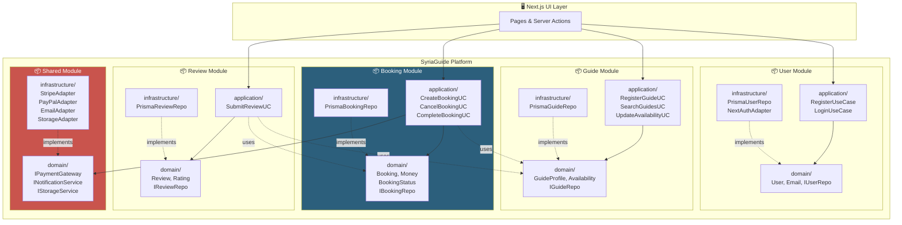
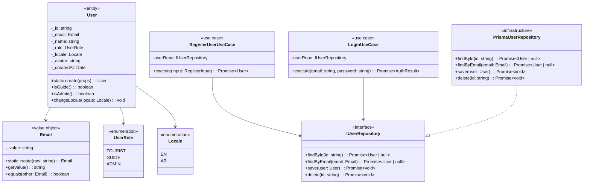
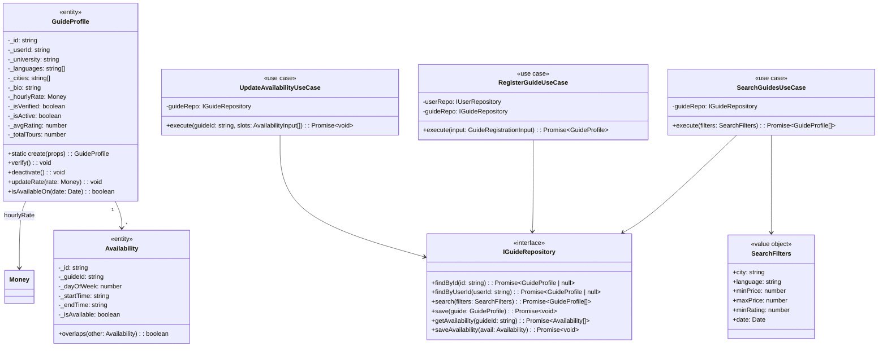
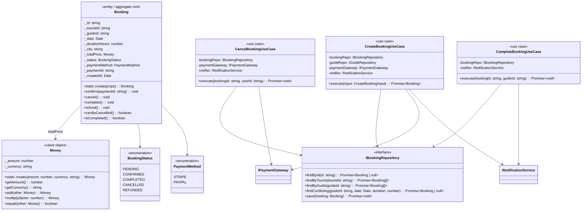
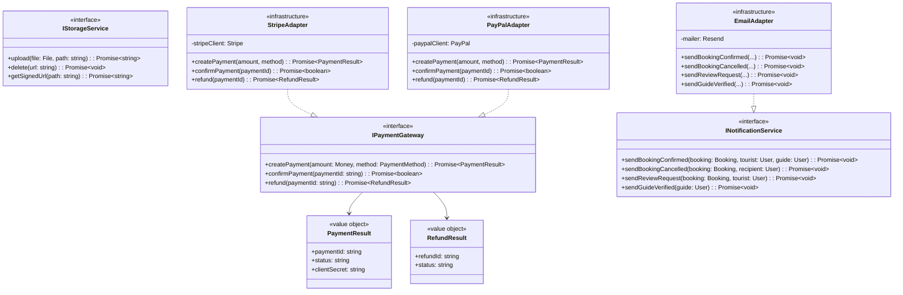
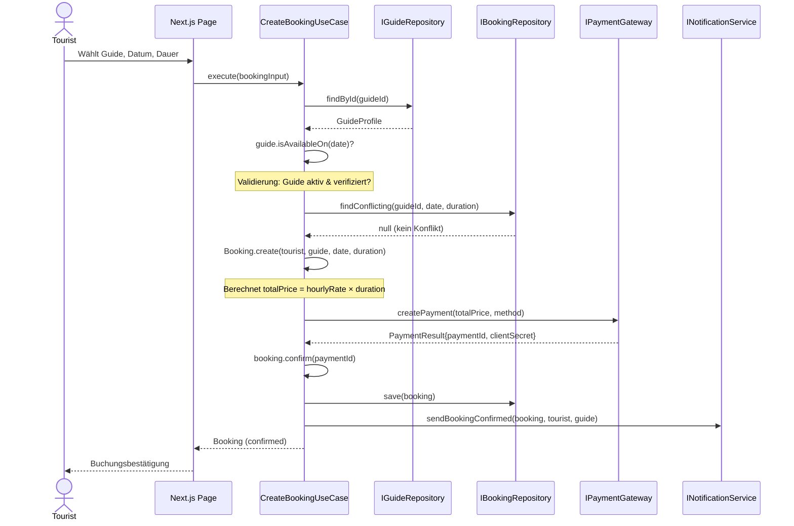
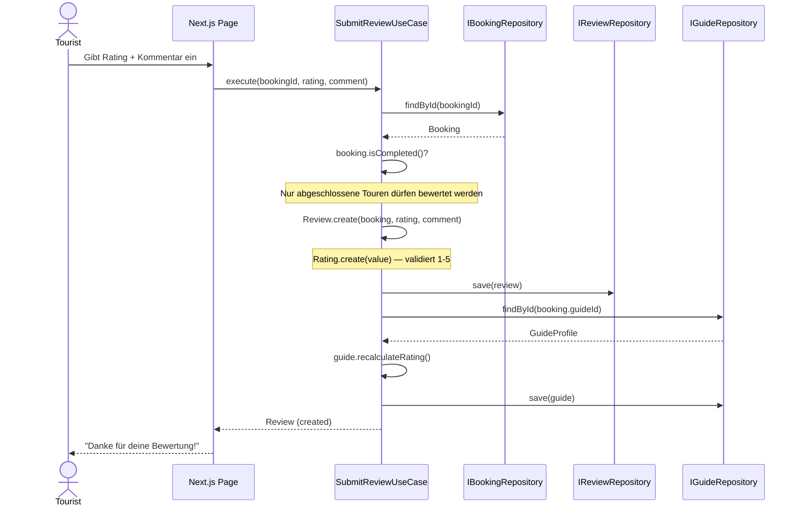
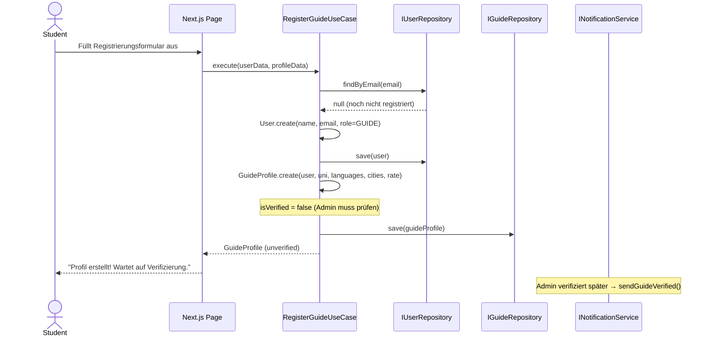
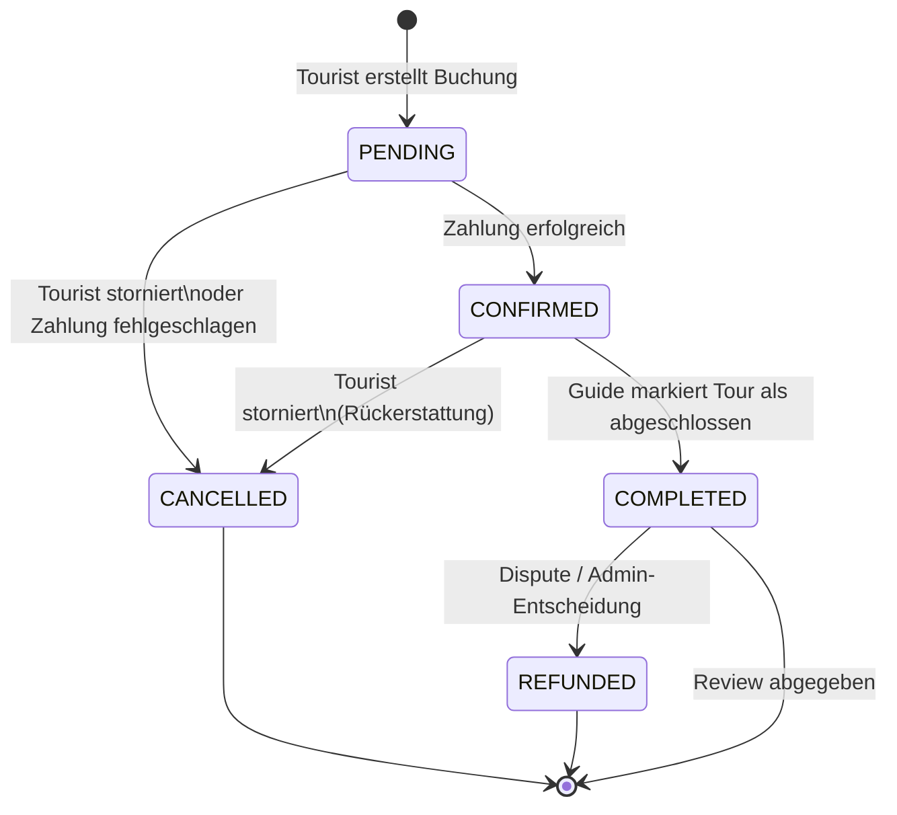
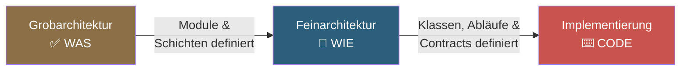

# 🇸🇾 SyriaGuide — Feinarchitektur (Detailed Design)

> Aufbauend auf der [Grobarchitektur](file:///home/mohammadibrahim/.gemini/antigravity-cli/brain/8687c52e-6db9-47b4-a53e-2d1404550ab2/syria-guide-grobarchitektur.md)

---

## 1. Abgrenzung: Grob- vs. Feinarchitektur

| Aspekt | Grobarchitektur ✅ (fertig) | Feinarchitektur 📐 (dieses Dokument) |
|--------|---------------------------|--------------------------------------|
| **Perspektive** | Vogelperspektive — Gesamtsystem | Interne Sicht — pro Komponente |
| **Abstraktion** | Hoch (welche Module gibt es?) | Niedrig (wie arbeiten Objekte zusammen?) |
| **Fragestellung** | „Wie sind die Bausteine verbunden?" | „Wie läuft ein Ablauf intern ab?" |
| **Diagramme** | Architektur-Übersicht, ER-Diagramm | Komponentendiagramm, Sequenzdiagramme, Zustandsdiagramm |
| **Ziel** | Technische Grundentscheidungen | Vorbereitung der Implementierung |

---

## 2. Komponentendiagramm (Modulare Zerlegung)

Jedes Modul ist intern nach Clean Architecture geschichtet.



---

## 3. Detailliertes Klassendiagramm

### 3.1 User Module — Intern



### 3.2 Guide Module — Intern



### 3.3 Booking Module — Intern



### 3.4 Shared Module — Service Interfaces



---

## 4. Sequenzdiagramme (Abläufe)

### 4.1 Buchung erstellen (Happy Path)



### 4.2 Bewertung abgeben



### 4.3 Guide-Registrierung



---

## 5. Zustandsdiagramm: Booking Lifecycle



---

## 6. Schnittstellenverträge (TypeScript Contracts)

```typescript
// ══════════════════════════════════════
// Value Objects — selbst-validierend
// ══════════════════════════════════════

interface IValueObject<T> {
  getValue(): T;
  equals(other: IValueObject<T>): boolean;
}

// ══════════════════════════════════════
// Entity — hat eine Identität
// ══════════════════════════════════════

interface IEntity {
  readonly id: string;
  equals(other: IEntity): boolean;
}

// ══════════════════════════════════════
// Repository — generisches Interface
// ══════════════════════════════════════

interface IRepository<T extends IEntity> {
  findById(id: string): Promise<T | null>;
  save(entity: T): Promise<void>;
  delete(id: string): Promise<void>;
}

// ══════════════════════════════════════
// Use Case — generisches Interface
// ══════════════════════════════════════

interface IUseCase<TInput, TOutput> {
  execute(input: TInput): Promise<TOutput>;
}
```

---

## 7. Datenfluss-Matrix

Welcher Use Case nutzt welche Interfaces:

| Use Case | IUserRepo | IGuideRepo | IBookingRepo | IReviewRepo | IPaymentGW | INotifier |
|----------|:---------:|:----------:|:------------:|:-----------:|:----------:|:---------:|
| RegisterUser | ✏️ | | | | | |
| Login | 🔍 | | | | | |
| RegisterGuide | ✏️ | ✏️ | | | | |
| SearchGuides | | 🔍 | | | | |
| UpdateAvailability | | ✏️ | | | | |
| **CreateBooking** | | 🔍 | ✏️ | | ✏️ | ✉️ |
| CancelBooking | | | ✏️ | | ✏️ | ✉️ |
| CompleteBooking | | | ✏️ | | | ✉️ |
| **SubmitReview** | | ✏️ | 🔍 | ✏️ | | |

> 🔍 = lesen, ✏️ = schreiben, ✉️ = benachrichtigen

---

## 8. Zusammenfassung



| Feinarchitektur-Element | Inhalt |
|------------------------|--------|
| **Komponentendiagramm** | 5 Module × 3 Schichten, Cross-Modul-Abhängigkeiten |
| **Klassendiagramme** | 4 Module detailliert: Entities, VOs, Interfaces, Use Cases |
| **Sequenzdiagramme** | 3 Kern-Abläufe: Buchung, Bewertung, Guide-Registrierung |
| **Zustandsdiagramm** | Booking Lifecycle: 5 Zustände, 7 Übergänge |
| **Contracts** | Generische Interfaces: IEntity, IValueObject, IRepository, IUseCase |
| **Datenfluss-Matrix** | 9 Use Cases × 6 Interfaces |

> [!TIP]
> Die Feinarchitektur ist **abstrakt genug** um Framework-unabhängig zu sein, aber **konkret genug** um direkt in TypeScript-Code übersetzt zu werden. Jedes Klassendiagramm → 1 Datei. Jedes Sequenzdiagramm → 1 Integration Test.
