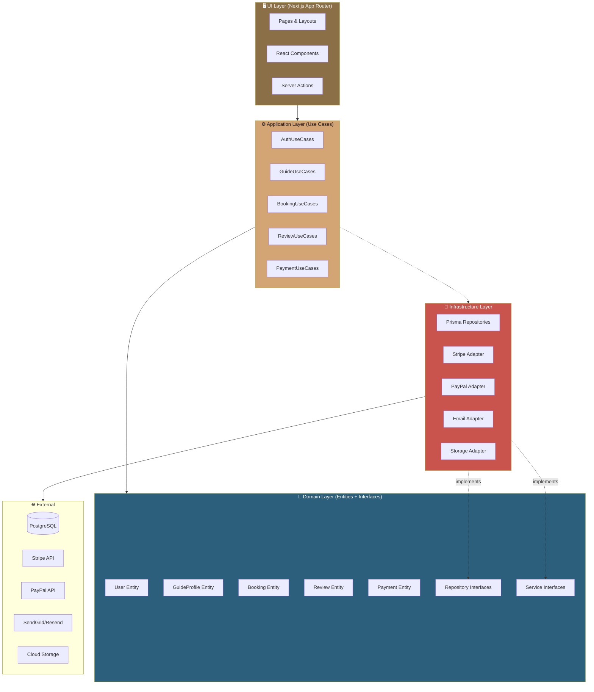
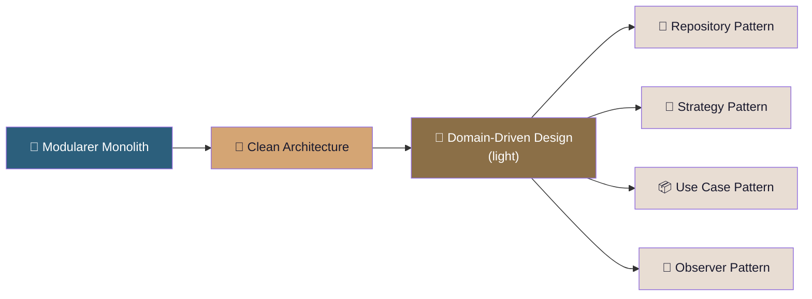

# 🇸🇾 SyriaGuide — Grobarchitektur & Klassendiagramm

---

## 1. Anforderungsanalyse (Requirements)

### 1.1 Funktionale Anforderungen

| # | Anforderung | Beschreibung | Priorität |
|---|-------------|-------------|-----------|
| F1 | **Benutzerregistrierung** | Tourist & Guide können sich registrieren (Email/OAuth) | 🔴 P0 |
| F2 | **Rollenverwaltung** | 3 Rollen: Tourist, Guide, Admin | 🔴 P0 |
| F3 | **Guide-Profil** | Uni, Sprachen, Städte, Spezialitäten, Fotos, Stundensatz | 🔴 P0 |
| F4 | **Suche & Filter** | Nach Stadt, Sprache, Preis, Bewertung, Verfügbarkeit | 🔴 P0 |
| F5 | **Buchungssystem** | Datum, Dauer, Tour-Art auswählen & buchen | 🔴 P0 |
| F6 | **Verfügbarkeitskalender** | Guide legt verfügbare Zeiten fest | 🔴 P0 |
| F7 | **Zahlung** | Stripe + PayPal, Escrow bis Tour abgeschlossen | 🔴 P0 |
| F8 | **Bewertungen** | Tourist bewertet Guide nach der Tour (1-5 Sterne + Text) | 🟡 P1 |
| F9 | **Benachrichtigungen** | Email bei Buchung, Bestätigung, Erinnerung | 🟡 P1 |
| F10 | **Guide-Verifizierung** | Admin prüft & verifiziert Studenten-Guides | 🟡 P1 |
| F11 | **Mehrsprachigkeit** | Arabisch (RTL) + Englisch | 🔴 P0 |
| F12 | **Dashboard** | Tourist: Meine Buchungen / Guide: Einnahmen & Kalender | 🟡 P1 |
| F13 | **Admin-Panel** | Benutzer, Buchungen, Disputes verwalten | 🟢 P2 |

### 1.2 Nicht-funktionale Anforderungen

| # | Anforderung | Details |
|---|-------------|---------|
| NF1 | **Skalierbarkeit** | Muss bei Tourismus-Hochsaison skalieren |
| NF2 | **Verfügbarkeit** | Hohe Uptime — Buchungen dürfen nie ausfallen |
| NF3 | **Konsistenz** | Keine Doppelbuchungen (ACID-Transaktionen) |
| NF4 | **Performance** | Suchergebnisse < 500ms, schnelle Seitenladezeiten |
| NF5 | **Sicherheit** | PCI-DSS für Zahlungen, DSGVO für Nutzerdaten |
| NF6 | **SEO** | SSR für Suchmaschinen-Sichtbarkeit (Tourismus!) |
| NF7 | **Mobile-First** | Touristen buchen oft unterwegs vom Handy |
| NF8 | **RTL-Support** | Vollständige Arabisch-Unterstützung (Right-to-Left) |

---

## 2. Architektur-Vergleich: Welche passt?

Basierend auf der Recherche gibt es 3 Hauptkandidaten:

### Option A: Microservices Architecture

```
[API Gateway] → [User Service] → [User DB]
              → [Booking Service] → [Booking DB]
              → [Payment Service] → [Stripe/PayPal]
              → [Search Service] → [Elasticsearch]
              → [Notification Service] → [Email]
```

| Pro | Contra |
|-----|--------|
| Unabhängig skalierbar | Hohe Komplexität für kleines Team |
| Technologie-Flexibilität | DevOps-Overhead (Docker, K8s, Service Mesh) |
| Isolierte Deployments | Distributed Transactions (Saga Pattern nötig) |
| | **Overkill für ein Startup-MVP** |

> ❌ **Nicht empfohlen** — Zu komplex für den Start. Syriens Tourismus-Markt ist noch klein.

---

### Option B: Klassischer Monolith (MVC)

```
[Next.js App]
  ├── Pages (Views)
  ├── API Routes (Controllers)
  └── Database Queries (direkt, kein Layer)
```

| Pro | Contra |
|-----|--------|
| Einfach & schnell | Keine Trennung von Business-Logik |
| Wenig Boilerplate | Wird schnell unübersichtlich |
| Schnelles MVP | Schwer testbar |
| | **Spaghetti-Code bei Wachstum** |

> ⚠️ **Bedingt empfohlen** — Zu simpel für Buchung + Zahlung + Multi-Rolle.

---

### Option C: Modularer Monolith + Clean Architecture ✅

```
[Next.js App Router — UI Layer]
       ↓
[Application Layer — Use Cases]
       ↓
[Domain Layer — Entities + Interfaces]
       ↓
[Infrastructure Layer — DB, APIs, Email]
```

| Pro | Contra |
|-----|--------|
| Klare Schichtentrennung | Etwas mehr Boilerplate als MVC |
| Business-Logik testbar & unabhängig | Lernkurve für Clean Architecture |
| Einfach zu Microservices migrierbar | |
| Repository Pattern → DB austauschbar | |
| **Perfekt für Next.js + TypeScript** | |

> ✅ **EMPFOHLEN** — Beste Balance zwischen Einfachheit und Struktur.

---

## 3. Gewählte Architektur: Modularer Monolith + Clean Architecture

### 3.1 Architektur-Übersicht



### 3.2 Dependency Rule (Abhängigkeitsregel)

```
UI → Application → Domain ← Infrastructure
```

> [!IMPORTANT]
> Die **Domain-Schicht** ist das Herz. Sie kennt weder Next.js, noch Prisma, noch Stripe.
> Die Infrastructure implementiert die Interfaces, die in der Domain definiert sind.
> Das ist das **Dependency Inversion Principle (DIP)**.

### 3.3 Angewandte Design Patterns

| Pattern | Wo | Warum |
|---------|-----|-------|
| **Repository Pattern** | Data Access | Abstraktion über DB — Domain kennt kein Prisma |
| **Strategy Pattern** | Payment | Stripe und PayPal austauschbar hinter `IPaymentGateway` |
| **Observer Pattern** | Notifications | Bei Buchungsänderung → Email, Push etc. auslösen |
| **Factory Pattern** | Entity-Erstellung | Validierte Erstellung von Booking, User etc. |
| **Use Case Pattern** | Application Layer | Jeder Business-Flow = 1 Use Case Klasse |
| **Adapter Pattern** | Infrastructure | Externe APIs an interne Interfaces anpassen |
| **Value Object** | Domain | Geld (Money), Email, Rating — unveränderlich, validiert |

---

## 4. Klassendiagramm (Abstrakt & Simpel)

> **Fokus:** Abstraktion, Interfaces, Dependency Inversion. Keine Implementation-Details.

```mermaid
classDiagram
    direction TB

    %% ══════════════════════════════════════
    %% DOMAIN LAYER — Entities & Value Objects
    %% ══════════════════════════════════════

    class User {
        +id: string
        +email: Email
        +name: string
        +role: UserRole
        +locale: Locale
    }

    class GuideProfile {
        +id: string
        +user: User
        +university: string
        +languages: string[]
        +cities: string[]
        +hourlyRate: Money
        +isVerified: boolean
        +avgRating: number
        +isAvailable(date): boolean
    }

    class Booking {
        +id: string
        +tourist: User
        +guide: GuideProfile
        +date: Date
        +duration: number
        +totalPrice: Money
        +status: BookingStatus
        +confirm(): void
        +cancel(): void
        +complete(): void
    }

    class Review {
        +id: string
        +booking: Booking
        +rating: Rating
        +comment: string
    }

    class Availability {
        +id: string
        +guide: GuideProfile
        +dayOfWeek: number
        +startTime: Time
        +endTime: Time
    }

    %% Value Objects
    class Money {
        +amount: number
        +currency: string
        +add(other): Money
        +multiply(factor): Money
    }

    class Rating {
        +value: number
        +isValid(): boolean
    }

    class Email {
        +value: string
        +isValid(): boolean
    }

    %% Enums
    class UserRole {
        <<enumeration>>
        TOURIST
        GUIDE
        ADMIN
    }

    class BookingStatus {
        <<enumeration>>
        PENDING
        CONFIRMED
        COMPLETED
        CANCELLED
    }

    %% ══════════════════════════════════════
    %% DOMAIN LAYER — Repository Interfaces
    %% ══════════════════════════════════════

    class IUserRepository {
        <<interface>>
        +findById(id): User
        +findByEmail(email): User
        +save(user): void
    }

    class IGuideRepository {
        <<interface>>
        +findById(id): GuideProfile
        +search(filters): GuideProfile[]
        +save(guide): void
    }

    class IBookingRepository {
        <<interface>>
        +findById(id): Booking
        +findByTourist(userId): Booking[]
        +findByGuide(guideId): Booking[]
        +save(booking): void
    }

    class IReviewRepository {
        <<interface>>
        +findByGuide(guideId): Review[]
        +save(review): void
    }

    %% ══════════════════════════════════════
    %% DOMAIN LAYER — Service Interfaces
    %% ══════════════════════════════════════

    class IPaymentGateway {
        <<interface>>
        +createPayment(amount, method): PaymentResult
        +refund(paymentId): RefundResult
    }

    class INotificationService {
        <<interface>>
        +sendBookingConfirmed(booking): void
        +sendReviewRequest(booking): void
    }

    %% ══════════════════════════════════════
    %% APPLICATION LAYER — Use Cases
    %% ══════════════════════════════════════

    class SearchGuidesUseCase {
        -guideRepo: IGuideRepository
        +execute(filters): GuideProfile[]
    }

    class CreateBookingUseCase {
        -bookingRepo: IBookingRepository
        -guideRepo: IGuideRepository
        -payment: IPaymentGateway
        -notifier: INotificationService
        +execute(touristId, guideId, date, duration): Booking
    }

    class SubmitReviewUseCase {
        -reviewRepo: IReviewRepository
        -bookingRepo: IBookingRepository
        -guideRepo: IGuideRepository
        +execute(bookingId, rating, comment): Review
    }

    class RegisterGuideUseCase {
        -userRepo: IUserRepository
        -guideRepo: IGuideRepository
        +execute(userData, profileData): GuideProfile
    }

    %% ══════════════════════════════════════
    %% INFRASTRUCTURE LAYER — Implementations
    %% ══════════════════════════════════════

    class PrismaUserRepository {
        +findById(id): User
        +findByEmail(email): User
        +save(user): void
    }

    class PrismaGuideRepository {
        +findById(id): GuideProfile
        +search(filters): GuideProfile[]
        +save(guide): void
    }

    class PrismaBookingRepository {
        +findById(id): Booking
        +findByTourist(userId): Booking[]
        +findByGuide(guideId): Booking[]
        +save(booking): void
    }

    class StripePaymentGateway {
        +createPayment(amount, method): PaymentResult
        +refund(paymentId): RefundResult
    }

    class PayPalPaymentGateway {
        +createPayment(amount, method): PaymentResult
        +refund(paymentId): RefundResult
    }

    class EmailNotificationService {
        +sendBookingConfirmed(booking): void
        +sendReviewRequest(booking): void
    }

    %% ══════════════════════════════════════
    %% RELATIONSHIPS
    %% ══════════════════════════════════════

    %% Domain Entity Relationships
    User "1" --> "0..1" GuideProfile : has profile
    User "1" --> "*" Booking : books as tourist
    GuideProfile "1" --> "*" Booking : receives
    GuideProfile "1" --> "*" Availability : sets schedule
    GuideProfile "1" --> "*" Review : receives
    Booking "1" --> "0..1" Review : gets reviewed

    %% Value Objects
    User --> Email : uses
    User --> UserRole : has role
    GuideProfile --> Money : hourlyRate
    Booking --> Money : totalPrice
    Booking --> BookingStatus : has status
    Review --> Rating : has rating

    %% Interface Implementations (Dependency Inversion)
    PrismaUserRepository ..|> IUserRepository
    PrismaGuideRepository ..|> IGuideRepository
    PrismaBookingRepository ..|> IBookingRepository
    StripePaymentGateway ..|> IPaymentGateway
    PayPalPaymentGateway ..|> IPaymentGateway
    EmailNotificationService ..|> INotificationService

    %% Use Cases depend on Interfaces (not implementations)
    SearchGuidesUseCase --> IGuideRepository
    CreateBookingUseCase --> IBookingRepository
    CreateBookingUseCase --> IGuideRepository
    CreateBookingUseCase --> IPaymentGateway
    CreateBookingUseCase --> INotificationService
    SubmitReviewUseCase --> IReviewRepository
    SubmitReviewUseCase --> IBookingRepository
    SubmitReviewUseCase --> IGuideRepository
    RegisterGuideUseCase --> IUserRepository
    RegisterGuideUseCase --> IGuideRepository
```


---

## 5. Schichten-Erklärung im Detail

### 💎 Domain Layer (Kern — keine Abhängigkeiten)

```
src/modules/
├── user/domain/
│   ├── entities/User.ts           # User Entity
│   ├── valueObjects/Email.ts      # Email Value Object
│   └── repositories/IUserRepository.ts   # Interface
├── guide/domain/
│   ├── entities/GuideProfile.ts
│   ├── entities/Availability.ts
│   └── repositories/IGuideRepository.ts
├── booking/domain/
│   ├── entities/Booking.ts
│   ├── valueObjects/Money.ts
│   └── repositories/IBookingRepository.ts
├── review/domain/
│   ├── entities/Review.ts
│   ├── valueObjects/Rating.ts
│   └── repositories/IReviewRepository.ts
└── shared/domain/
    └── services/IPaymentGateway.ts
    └── services/INotificationService.ts
```

>
 [!NOTE]
> **Keine Imports von Prisma, Next.js, Stripe hier!** Nur reines TypeScript.

### ⚙️ Application Layer (Use Cases)

```
src/modules/
├── guide/application/
│   ├── SearchGuidesUseCase.ts
│   └── RegisterGuideUseCase.ts
├── booking/application/
│   └── CreateBookingUseCase.ts
└── review/application/
    └── SubmitReviewUseCase.ts
```

### 🔧 Infrastructure Layer (Implementierungen)

```
src/modules/
├── user/infrastructure/
│   └── PrismaUserRepository.ts       # implements IUserRepository
├── guide/infrastructure/
│   └── PrismaGuideRepository.ts      # implements IGuideRepository
├── booking/infrastructure/
│   └── PrismaBookingRepository.ts    # implements IBookingRepository
└── shared/infrastructure/
    ├── StripePaymentGateway.ts        # implements IPaymentGateway
    ├── PayPalPaymentGateway.ts        # implements IPaymentGateway
    └── EmailNotificationService.ts    # implements INotificationService
```

---

## 6. Warum diese Architektur für SyriaGuide?

| Anforderung | Wie die Architektur sie löst |
|-------------|------------------------------|
| **Keine Doppelbuchungen (NF3)** | Booking-Entity validiert Verfügbarkeit, PostgreSQL ACID garantiert Konsistenz |
| **Stripe + PayPal (F7)** | Strategy Pattern: `IPaymentGateway` → austauschbare Implementierungen |
| **SEO für Tourismus (NF6)** | Next.js SSR → Guide-Profile & Städteseiten werden server-seitig gerendert |
| **RTL Arabic (NF8)** | UI Layer isoliert → RTL betrifft nur die Präsentationsschicht |
| **Guide-Verifizierung (F10)** | Domain-Logik in `GuideProfile.verify()` → unabhängig von UI |
| **Testbarkeit** | Use Cases testen mit Mock-Repositories — kein DB nötig |
| **Spätere Migration** | Module sind Bounded Contexts → können zu Microservices werden |

---

## 7. Zusammenfassung



> **Architektur:** Modularer Monolith + Clean Architecture
> **Patterns:** Repository, Strategy, Observer, Factory, Use Case, Adapter, Value Object
> **Sprache:** TypeScript (Fully Typed)
> **Framework:** Next.js (App Router) + Prisma + PostgreSQL
> **Prinzip:** Abstraktion & Einfachheit — Domain kennt keine Frameworks

> [!TIP]
> Diese Architektur ist **bewusst einfach gehalten** (KISS), aber **erweiterbar**. Wenn SyriaGuide wächst, können einzelne Module zu Microservices extrahiert werden, ohne die Business-Logik zu ändern.
